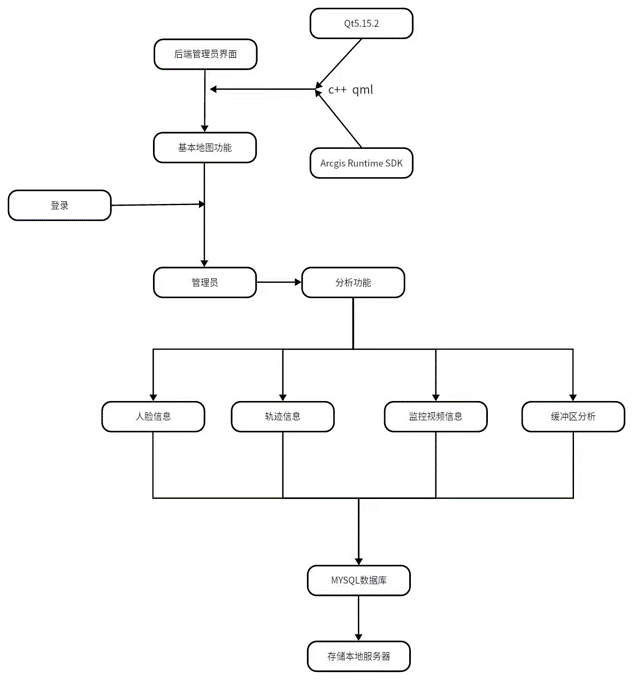
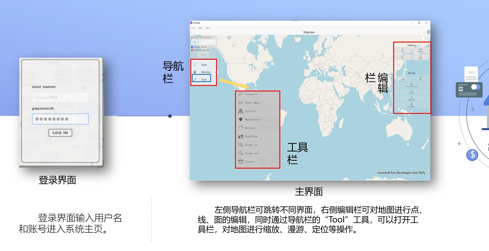

# Secondary_development_based_on_ArcEngine
Secondary map development using ArcEngine SDK and Qt, prototype of urban monitoring and trajectory tracking system

## Environment

---

## 技术路线

  

## 界面展示及基本功能

  

## 功能展示
https://github.com/zplzmzmpl/Secondary_development_based_on_ArcEngine/assets/121420991/8700f601-aca6-48a7-8517-974c3b0f8dae

